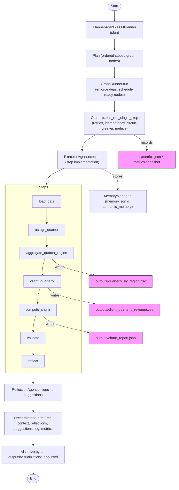

# Pipeline execution — flow & post‑run state

This page explains the runtime flow in plain language and points you to the places you’ll want to inspect when debugging or reviewing a run.

---

## Quick debugging spots
- `agents/orchestrator.py` → `Orchestrator.run()` — entry point for a full pipeline run.
- `agents/orchestrator.py` → `GraphRunner.run()` — where dependencies are scheduled.
- `agents/orchestrator.py` → `_run_single_step()` — retry, idempotency, and circuit‑breaker logic.
- `agents/orchestrator.py` → `ExecutorAgent.execute()` — where step implementations run.
- `agents/visualize.py` → plotting helpers (verify artifact outputs).

## Useful runtime artifacts to inspect
- `context` object: evolving run state (typical keys: `df`, `agg`, `client_q`, `churn_reports`, `reflections`).
- `self.log`: per‑step status, attempt counts, and error traces.
- `self.metrics.snapshot()`: counters and timing metrics.
- Disk outputs: `outputs/churn_report.json`, `outputs/*.csv`, `outputs/metrics.json`, and `outputs/visualization/*`.
- Memory files: `outputs/memory.json` and `outputs/semantic_memory.json` (if semantic memory is enabled).

## Common questions this answers
- Who schedules steps? → `GraphRunner`.
- Where do retries and circuit‑breaker live? → `_run_single_step` / `CircuitBreaker`.
- Where is data persisted? → step handlers in `ExecutorAgent` and `visualize.py` for artifacts.

---

## Next steps
1. Add `logger.debug` statements at a few key points and run the graph‑runner test so you can step through execution. ✅
2. Export the Mermaid diagram to an SVG/PNG and add it to `docs/` for a visual reference. 🖼️

Reply with `1`, `2`, or `both` and I’ll implement them.